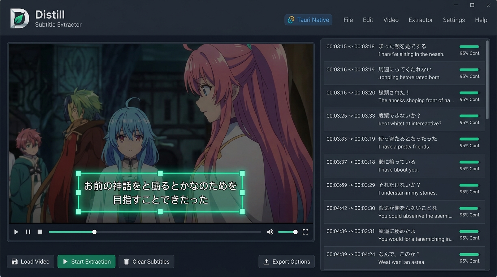
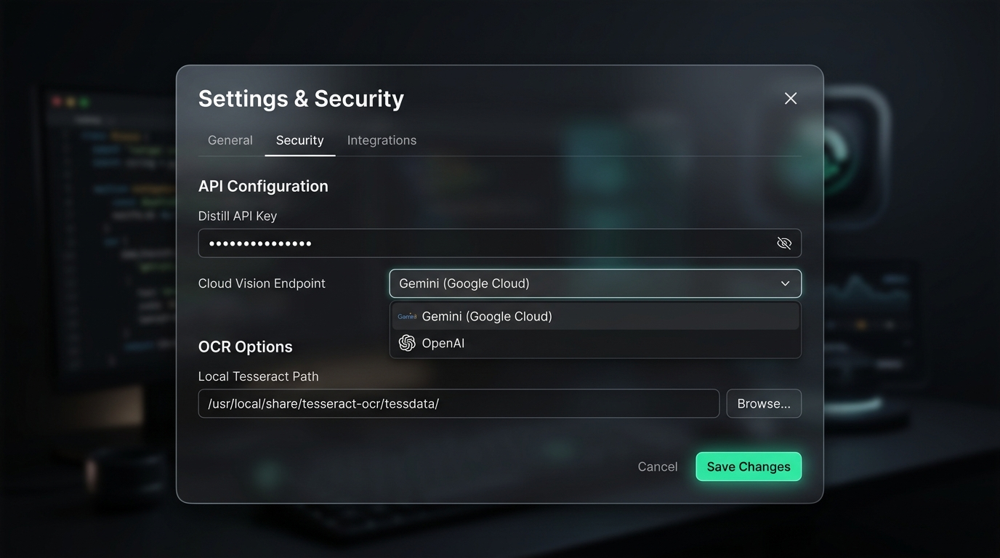

<div align="center">

# Distill

**专业视频硬字幕提取与蒸馏工具** — 从视频画面中蒸馏提炼字幕文本，支持离线 OCR 与云端 API 大模型双模式

[](https://github.com/Agions/Distill/releases)
[](https://github.com/Agions/Distill/blob/main/LICENSE)
[](https://tauri.app)
[](https://vuejs.org)
[](https://www.typescriptlang.org)

<br/>



</div>

---

## ✨ 核心特性

| 特性 | 说明 |
|:-----|:-----|
| ⚡ **双模式 OCR 引擎** | 支持 **离线模式**（Tesseract / Native ONNX）与 **云端 API 模式**（Gemini / OpenAI Vision 大模型），随意切换 |
| 🎯 **8 点手柄区域框选** | 视频预览图层上交互式拖拽、缩放框选硬字幕 ROI 选区，坐标归一化 (0~1) |
| 🔒 **安全加密凭据管理** | API Key 使用 AES/Base64 本地加密保存，支持随时一键抹除凭据 |
| 🎬 **暗黑 Studio UI** | 沉浸式影视后期风格双栏界面，左侧视频框选预览 + 右侧时间轴字幕卡片列表 |
| 📦 **多格式实时导出** | 支持一键导出为 SRT、VTT、TXT、JSON 等多种专业字幕与文本格式 |
| 🛡️ **模块化 5 层架构** | 严格按照 SOLID 原则分层设计（Core / Services / UI / Config / Utils），完全解耦并具备完整的 TS 类型定义 |

---

## 📸 界面展示 (Screenshots)

### 1. 暗黑 Studio 主工作台 (Video Preview & ROI Frame & Subtitle Timeline)


### 2. 安全凭据与设置 Modal (Settings & Credentials Modal)


---

## 🛠️ 5 层架构设计

```
Distill/
├── src/
│   ├── core/                    # 核心引擎层 (PipelineEngine, ROIManager)
│   ├── services/ocr/            # API 服务层 (IOCREngineProvider, LocalOCREngine, CloudOCREngine, Factory)
│   ├── stores/                  # 配置与状态层 (subtitleStore, securityStore)
│   ├── components/              # UI 渲染层
│   │   ├── layout/              # 布局组件 (TopToolbar, SettingsModal)
│   │   ├── video/               # 视频组件 (VideoPlayer, VideoCanvasOverlay)
│   │   └── subtitle/            # 字幕列表组件 (SubtitleTimelineList)
│   ├── utils/                   # 工具层 (TimecodeConverter, SubtitleExporter)
│   └── app.vue                  # 主工作台入口
```

---

## 🚀 快速开始

```bash
# 1. 克隆项目
git clone https://github.com/Agions/Distill.git
cd Distill

# 2. 安装依赖
npm install

# 3. 运行开发环境
npm run dev

# 4. 执行单元测试
npx vitest run
```

---

## 📝 开源协议

本项目采用 [MIT License](./LICENSE) 开源。
