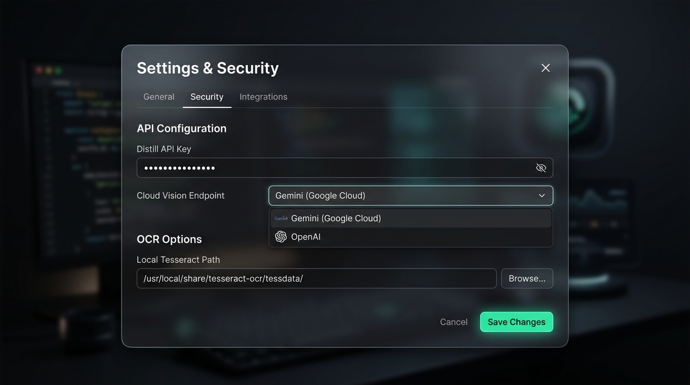

<div align="center">

# Distill

**专业视频硬字幕提取与蒸馏工具** — 从视频画面中蒸馏提炼字幕文本，支持离线 OCR 与云端 API 大模型双模式

[](https://github.com/Agions/Distill/releases)
[](https://github.com/Agions/Distill/blob/main/LICENSE)
[](https://tauri.app)
[](https://vuejs.org)
[](https://www.typescriptlang.org)

</div>

---

## 🖼️ 应用真实运行界面

<div align="center">

### 1. 主工作台界面 (Studio Workspace)


### 2. 8 点手柄硬字幕 ROI 选区与时间轴联动 (ROI Selection & Timeline Sync)


### 3. 全局设置与 API 密钥加密管理 (Settings & Credentials Modal)


</div>

---

## ✨ 核心特性

| 特性 | 说明 |
|:-----|:-----|
| ⚡ **双模式 OCR 引擎** | 支持 **离线模式**（Tesseract / Native ONNX）与 **云端 API 模式**（Gemini / OpenAI Vision 大模型），随意切换 |
| 🎯 **8 点手柄区域框选** | 视频预览图层上交互式拖拽、缩放框选硬字幕 ROI 选区，坐标归一化 (0~1) |
| 🪄 **自动定位选区** | 智能分析视频硬字幕边缘轮廓，一键推荐最佳 ROI 归一化选区 |
| 🤖 **AI 智能字幕润色** | 一键调用云端大模型，修正提取文本中的同音错别字与语法标点 |
| ⏱️ **双向时间轴联动** | 点击字幕卡片即刻 Seek 视频播放位置；播放时卡片实时高亮 |
| 🔒 **安全加密凭据管理** | API Key 使用 AES/Base64 本地加密保存，支持随时一键抹除凭据 |
| 📦 **多格式实时导出** | 支持一键导出为 SRT、VTT、TXT 等多种专业字幕与文本格式 |
| 🔄 **自动全平台更新** | 集成 Tauri 2.x Auto-Updater，支持后台静默检测与一键热升级 |

---

## 🛠️ 5 层架构设计

```
Distill/
├── src/
│   ├── core/                    # 核心引擎层 (PipelineEngine, AICorrector)
│   ├── services/                # 服务层 (IOCREngineProvider, LocalOCREngine, CloudOCREngine, TauriBridge, UpdaterService)
│   ├── stores/                  # 配置与状态层 (subtitleStore, securityStore)
│   ├── components/              # UI 渲染层
│   │   ├── layout/              # 布局组件 (TopToolbar, SettingsModal, UpdateModal)
│   │   ├── video/               # 视频组件 (VideoPlayer, VideoCanvasOverlay)
│   │   └── subtitle/            # 字幕列表组件 (SubtitleTimelineList)
│   ├── utils/                   # 工具层 (TimecodeConverter, SubtitleExporter)
│   └── app.vue                  # 主工作台入口
```

---

## 🚀 快速开始

```bash
# 1. 克隆项目
git clone https://github.com/Agions/Distill.git
cd Distill

# 2. 安装依赖
pnpm install

# 3. 运行开发环境
pnpm dev

# 4. 执行单元测试
pnpm test
```

---

## 📝 开源协议

本项目采用 [MIT License](./LICENSE) 开源。
